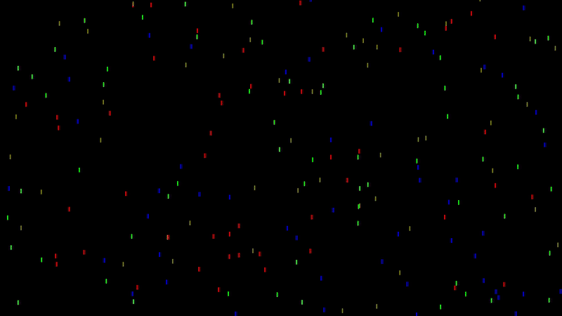

# Symulacja deszczu w Pygame



Jest to prosta symulacja kropli deszczu spadających na ekranie, stworzona z użyciem biblioteki Pygame. Program generuje losowe krople deszczu, które spadają z góry okna, a także odtwarza dźwięk deszczu w tle.

## Funkcje:
- Krople deszczu spadające z losowych pozycji i w różnych kolorach.
- Ciągły dźwięk deszczu w tle.
- Dynamiczna aktualizacja ekranu symulująca deszcz.

## Wymagania:
- Python 3.x
- Biblioteka Pygame
- Plik dźwiękowy `rain_sound.mp3` (dźwięk deszczu)

## Instalacja:

1. Zainstaluj Pythona 3, jeśli jeszcze go nie masz: https://www.python.org/downloads/
2. Zainstaluj bibliotekę Pygame:
    ```bash
    pip install pygame
    ```
3. Pobierz lub sklonuj ten repozytorium.
4. Upewnij się, że plik `rain_sound.mp3` oraz `example.gif` znajdują się w tym samym katalogu co skrypt.

## Jak uruchomić:

1. Pobierz lub sklonuj to repozytorium.
2. Upewnij się, że pliki `rain_sound.mp3` oraz `example.gif` znajdują się w tym samym folderze co skrypt.
3. Uruchom skrypt:
    ```bash
    python rain_simulation.py
    ```

## Personalizacja:
- Możesz zmienić liczbę kropli deszczu, edytując zmienną `num_raindrops`.
- Prędkość spadania kropli można dostosować przez zmianę zmiennej `raindrop_speed`.
- Kolory kropli deszczu są losowo wybierane z predefiniowanej listy, ale możesz dodać więcej kolorów, edytując listę `raindrop_colors`.

## Rozwiązywanie problemów:
- Jeśli program nie wczytuje dźwięku, upewnij się, że plik `rain_sound.mp3` znajduje się w tym samym katalogu co skrypt.
- Sprawdź, czy moduł `pygame.mixer` został poprawnie zainicjowany.

## Licencja:
Ten projekt jest licencjonowany na zasadach licencji MIT.

## Podziękowania:
- Dokumentacja Pygame: https://www.pygame.org/docs/
